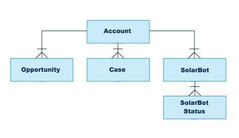

# Lightning Experience Reports & Dashboards Specialist

* TrailheadのSuperbadge、[Lightning Experience Reports & Dashboards Specialist](https://trailhead.salesforce.com/ja/content/learn/superbadges/superbadge-lex-rd)の日本語訳(**非公式**)です。
* 各カスタマイズ要素のラベル部分には補足として日本語を括弧内に記載している場合がありますが、正解チェックは英語のラベルを元に行われるため、実際のチャレンジには日本語表記を含めず、英語表記のみを使用して行って下さい。また、チャレンジ前にユーザと組織の言語・ロケールを英語に切り替えておくことを推奨します。
* フィードバックや質問は大歓迎です。Issueか[Twitter](https://www.twitter.com/shunkosa)までお願いします。

---
## 事前準備とメモ
* ペンと紙を準備して、要件を読み進める際にメモを取ってください。
* このスーパーバッジ用に、新しいTrailhead Playgroundを作成してください。この組織をほかの目的で使用すると、課題について検証する際に問題を引き起こす可能性があります。[1](#footnote1)
* 商談オブジェクトの種別(Type)選択リストに、**SolarBot**を追加してください。[このヘルプ記事](https://help.salesforce.com/articleView?id=updating_picklists.htm&type=5)が参考になります。
* SolarBot社の買収に伴う資産を実装するため、[未管理パッケージ](https://login.salesforce.com/packaging/installPackage.apexp?p0=04t1H0000018iyq)をインストールしてください。管理パッケージ、非管理パッケージ、アプリケーションをAppExchangeからインストールする際に問題が発生した場合は、[この記事](https://force.desk.com/customer/en/portal/articles/2710899-installing-a-package-or-app-to-complete-a-trailhead-challenge?b_id=13478)に示す手順に従ってください。
* 未管理パッケージをインストールした後はSolarBotsアプリケーション内のData Importタブから、Importボタンを選択してください。[2](#footnote2)
* 以下の6つの公開グループを作成してください。
  * Executive Team (エグゼクティブチーム)
  * Report and Dashboard Administrators (レポート・ダッシュボード管理者)
  * Research and Development Team (R&D(研究開発)チーム)
  * Sales Leadership Team (セールスリーダシップチーム)
  * Sales Team (セールスチーム)
  * Support Team (サポートチーム)
* このスーパーバッジのすべてのステップはLightning Experienceで完了してください。
* このスーパーバッジで利用される用語のいくつかは、UIに表示される設定上の名称名と完全に一致しない場合があります。これは、Salesforceの機能に関する知識と、ビジネス上のニーズを満たす正しい機能を選択する能力をテストするためです

## ユースケース
Ursa Major Solar, Inc.は、最近、戦略的パートナーであるSolarBot Industriesを買収した太陽光エネルギー機器のサプライヤです。社名から分かるように、SolarBot IndustriesはSolarBotを作ります。SolarBotは自律型のロボット周辺機器で、割り当てられたソーラーパネルにゴミや破片が付着しないようにしたり、パネルのステータス指標に関して日次でIoTフィードバックを提供したり、パネルのメンテナンスを依頼したり追跡したりします。充電クレードルに戻ったときは「ビーッ！ビーッ！ブーン！」と鳴ります。SolarBotはかわいいロボットですが、パフォーマンスへの影響は深刻です。それらに塵、砂、水、苔が蓄積すると太陽光パネルの発電効率が最大で85％も減少してしまいます。Ursa Majorの顧客はSolarBotが好きで、SolarBot IndustriesとUrsa Majorの合併は円滑に進みました。

Ursa Major Solarの経営陣は、SolarBot Industriesのデータをできるだけ早く理解して適用したいと考えています。ケース、商談、IoTデータセットは、既にUrsa MajorのSalesforce組織にロードされています。データ分析や使用にあたってチームに情報を提供するのはあなた次第です。SolarBotの古いレポートを管理し、新しいレポートを設計し、エグゼクティブダッシュボードを作成し、レポートとダッシュボードのアクセスを管理し、レコードやアプリケーション上にデータを表示します。このデータを活用することで、チームは太陽光発電事業に関してよりいっそう明るい意思決定を行うことができるでしょう。

## 主要なステークホルダ
SolarBotのデータが欲しい部署のリーダやユーザに対してインタビューを行いました。彼/彼女らは必要なレポートやダッシュボードに関して多くの便利なフィードバックを与えてくれました。主要なステークホルダは以下の通りです。
* Sita Nagappan-Alvarez (CEO)
* Gabriela Livingston (セールスオペレーションスペシャリスト)
* Ada Balewa (製品サポートスペシャリスト)
* Maria Jimenez (システム管理者)

## 標準オブジェクト
Ursa Majorは以下の標準オブジェクトを利用しています.
* Account (取引先) — Usra Majorから機器を購入する法人顧客
* Opportunity (商談) — 顧客やリードに対する潜在的な販売
* Case (ケース) — 顧客から報告されるサポートに関する問題

## カスタムオブジェクト
SolarBot IndustriesはIoTデータを管理するためのシンプルなデータモデルを採用しています。以下のカスタムオブジェクトはUsra Majorのスキーマにマージされます。
* SolarBot — 取引先に割り当てられたSolarBot
* SolarBot Status — 各SolarBotからの、パネルの生産性や問題に関する日次のレポート

## エンティティ図

## ビジネス要件
### Challenge1. フォルダ管理とレポートの整理
#### フォルダ管理
あなたは、車の鍵が見つからなくて、ポケット、カバン、ジャケット、カウンターを探すときの恐怖感を知っていますか？そして、すべてが正しい場所にあるときの満足感についてはどうでしょうか？堅実なフォルダと情報セキュリティのバックボーンを備えたこのレポートプロジェクトを開始して、快適さと満足さを感じられるようにしましょう。Ursa MajorのSalesforceシステム管理者であるMaria Jimenezが、フォルダとアクセスの要件を整理するのを手伝ってくれました。

SolarBotのレポートフォルダは**SolarBot [チーム/グループ名] Reports**という命名規則を用いています。ここで、チームとグループは以下の通りです。
* Executive (エグゼクティブ)
* Sales (セールス)
* Support (サポート)
* R&D

また、サポートチームのフォルダ内には、**Status Reports**と呼ばれるサブフォルダがあります。

見失った車のキーを覚えていますか？あなたの猫が本棚の後ろでそれをトントン叩いていたことが分かりました。あなたは、それを必要とするあなたの家庭内の人、すなわち人間だけに棚へのアクセス権を与えることにします。同様の原則に従って、Ursa Majorでは、以下の要件に基づいて、既存の公開グループに対してのみレポートフォルダへのアクセスを許可します。以下のルールに従ってレポートフォルダへのアクセス権を設定しましょう。

* Report and Dashboard Administratorはすべてのレポートフォルダを参照でき、アクセス権を制御できます。
* Sales Leadership Teamはセールスのレポートのアクセスを制御でき、サポートのレポートを参照可能です。
* Sales Teamはセールスのレポートを参照可能です。
* Support Teamはサポートのレポートを参照・変更可能です。
* Executive Teamはすべてのレポートを参照可能で、エグゼクティブのレポートを変更できます。
* Research and Development(R&D) TeamはR&Dのレポートを管理でき、サポートのレポートを参照できます。

#### レポートの片付け
SolarBot Industriesのデータがあなたの組織にロードされてからの短時間の間に、レポートを作成しているユーザがいます。あなたは、データ分析(#datamagic!)にかかわる人々が大好きですが、フォルダの混乱や重複は好きではありません。ほとんどのユーザーはMariaのChatterのアナウンスに注意を払い、自分のレポートを個人用フォルダまたはチームフォルダに移動しました。しかし、いくつかのレポートが仲間から外れてしまっています。Mariaはこれらのレポートにラベルを付け、Acquisition Reportsフォルダに配置しました。ここで、レポート名に基づいてそれらのレポートを適切なフォルダに移動してください。削除するレポートは、Report Recycle Binフォルダに配置してください。

#### カスタムオブジェクトデータのレポート
レポートを片付けている間、いくつかのレポートにSolarBotやSolarBot Statusカスタムオブジェクトのシステム項目が含まれていることに気が付きました。それらの項目は隠されておらず、レポートを作成する際に単純に便利ではありません。そして、それらは潜在的に混乱を招きます。ユーザがこれらのカスタムオブジェクトのレポートを作成するためのソリューションを新規に設定してください。

* ソリューションのラベル名を **SolarBots and Status Data** としてください。
* ソリューションの説明に **Use this for creating reports that use SolarBot and SolarBot Status data.** と入力してください。
* 作成したソリューションをOther Reports(その他のレポート)のカテゴリに格納してください。
* このソリューションを利用するレポートには、関連するSolarBot Statusレコードの有無にかかわらず、SolarBotの情報が含まれます。SolarBotはまだ有効化されていないかもしれません。
* このソリューションでは、以下の項目をレポートで選択不可としてください。
  * kWh Roll-Up
  * Temp Roll-Up
  * Obscured Roll-Up
  * Number of Status Records
  * Maintenance Requested

これは、ユーザーがレポートを作成するために構築する唯一の新しいソリューションですが、あなたは最初から利用できるオプションでレポートを作成することもできます。

### Challenge 2. セールスレポートを作成する
お菓子屋さんにいる子供のように、セールスチームのメンバーは、Ursa Majorの顧客に販売する新しい選択肢について目を丸くして興奮しています。セールスオペレーションのGabriela Livingstonは、セールスコールシートについて1回目のアイデアを送ってきました。以下のレポートを作成したら、セールスチーム用に作成したフォルダにそれらのレポートを配置します。それではレポートの作成に取り掛かりましょう！

#### SolarBotの商談が無い取引先
Gabrielaとセールスチームは、ファミリーの中で最も新しく、最も働いているメンバーであるSolarBotを、Usra Majorの全顧客に紹介することに、個人的な義務感を抱いています。どの顧客に電話をかけるべきかを列挙したレポートが必要です。データ統合プロセスにより、SolarBotの潜在的な販売活動は、商談の種別の選択リストが**SolarBot**に設定されています。この新しいレポート**Accounts Without SolarBot Opportunities**では、まだSolarBotに関わる商談がない取引先の取引先名、取引先の電話番号、および取引先の種別を表示する必要があります。このレポートには、標準のレポートタイプを使用してください。

#### SolarBotの優先順位の高いケースの候補
Ursa Majorの優れたサポートチームが対応するとしても、カスタマーサポートへ連絡することは、人々にとって楽しいことではありません。残念ながら、Ursa Majorには、他の誰よりもサポートを必要としている顧客がいます。サポートケースのパターンを分析すると、パネルのパフォーマンス低下が永続的な問題であることが分かりました。Ursa Majorのセールスチームは、SolarBotによりパネルのクリーニングとメンテナンスを行うことでソーラーパネルの性能が大幅に向上することを知っています。そこでチームは、頻繁に連絡してくる顧客と話したいと思っています。Gabrielaは、**SolarBot High-Case Candidates**というレポートを必要としています。このレポートでは、SolarBotを持たないすべての取引先の電話番号、ケースの件名、オープンフラグ、クローズ済フラグを表示し、取引先ごとにレコードを整理します。
* 取引先ごとに1回だけ電話を表示することでレポートを簡素化してください。
* セールスチームが、SolarBotを販売するのにどの顧客が最適かを確認しやすくするため、ケースの数が多い順に一覧を優先度付けしてください。
* Mariaは取引先オブジェクトにNumber of SolarBots (SolarBotの数)という積み上げ集計項目を追加しました。この項目は、取引先に紐づくSolarBotの数を表示します。

#### SolarBotの保証コールシート
おや、セールスチームの誕生日ですか？彼らはSolarBotがメニュー上の唯一の新製品ではないことを学びました。すべてのボットには別途販売されているメンテナンス保証もあります。チームが販売を開始するために、Gabrielaは**SolarBot Warranty Call Sheet**というレポートを求めています。このレポートには、取引先、電話番号、Warranty Status(保証状況)、および保証対象外のSolarBotごとに、いつ保証が期限が切れたかを表示します。このレポートを意図した通りに機能させるため、表示される取引先を決定する基準をユーザーが調整できないようにしましょう。

### Challenge 3. サポートレポートを作成する
Ursa Majorのサポートチームは買収以来、SolarBotを修理・テスト・改善してきています(その結果、SolarbBotは良いポータブル飲料用コースターを作り出しています)。チームはSolarBotの未来を明るく見ています。顧客はパネルに関する問題が少なくなるため、サポートへの問い合わせは少なくて済みます。しかし、そうであっても、チームはSolarbBotをどう保守していくかを懸念しています。製品サポートスペシャリストのAda Balewaは、サポートチームのSolarBotサポート対応の準備を手伝っています。彼女はあなたにいくつかのレポートを依頼しました。

### SolarBot Ownershipによる上位ケース発生要因
Adaの最初の仕事は、SolarBotを所有している顧客がサポートを求めている理由と、その問題がSolarBotを所有していない顧客からのものと異なるかどうかを理解することです。SolarBotsが故障するのですか？彼らは汚れてしまって、それを綺麗にするためにさらに小さなボットを必要としますか？彼らは電気羊の夢を見ていますか？ケースが、SolarBotオーナーのカテゴリ間でどのように分布しているかを調べるため、**Top Case Drivers by SolarBot Ownership**というレポートを作成します。
* 3つのカテゴリに分かれる**SolarBot Ownership**という分類項目を作成してレポートを整理します。
  * SolarBotを1つも所有していない場合は**No SolarBots**と表示します。
  * SolarBotを1から3つ所有している場合は**Some SolarBots**と表示します。
  * 3つ以上SolarBotを所有している場合は**Several SolarBots**と表示します。
  * SolarBot Ownershipで分類した後は、ケースを原因で集計します。
* ケースごとに、取引先名と件名を表示します。
* 個々のケースを表示しますが、レコードの合計は表示しません。
* レポートはサポートチームのために作成したフォルダに保存します。

### SolarBotのステータス平均
Adaとのミーティングの間、チームの誰かがSolarBotの顧客からの最初の入電を転送します。AdaはSolarBotに関する質問に答えることに問題はありませんが、彼女はレコードにある必要なすべての情報をすばやく見つけることができません。彼女は毎日のKilowatt Hours(発電量)、Panel Temperature(パネル温度)、Percent Obscured(雲に覆われている割合)を見ることができますが、他のSolarBotと比較した最近の平均とパフォーマンスの傾向を推測することしかできません。Adaは、すべてのSolarBotの、平均のPercent Obscured(雲に覆われている割合)、平均のPanel Temperature(パネル温度)、平均Kilowatt Hours(発電量)を、Status Dateごとに表示する、**SolarBot Status Averages**というレポートを作成して欲しいと思っています。サポートチームは毎日の平均だけを知る必要があります。彼らは個々のSolarBotに関する情報、レコードの数、集計を見る必要はありません。このレポートを**Status Reports**(ステータスレポート)フォルダに保存します。

### Challenge 4. R&Dレポートを組み立てる
Usra Majorの研究開発(R&D)チームは、SolarBot社の買収が完了したことを歓迎しています。彼らはSolarBot社の製品の長所と短所を理解したいので、パネル温度と発電量の間の傾向を評価するのに役立つレポート**Temperature to kWh Research**を作成するよう依頼しました。レポートは以下の要件を満たす必要があります。

* **Temperature Range** (温度範囲)という項目でレコードを4つのカテゴリに分類します。最も温度の低いTemperature Rangeからレポートの先頭に表示してください。
  * 65℃以下は**Low**を表示します。
  * 65℃より大きく80℃までは**Medium**と表示します。
  * 80℃より大きく95℃までは**High**と表示します。
  * 95℃より大きい場合は**Very High**と表示します。 (人間にもBotにも不快な温度です)
* 各Temperature Rangeで、平均のKilowatt Hours(発電量)と平均のPanel Temperature(パネル温度)だけを表示します。
* R&Dチーム用に作成したフォルダにレポートを格納します。

### Challenge 5. エグゼクティブレポートを実装する
Ursa Majorの全体的なビジネスの見通しは既に良かったのですが、SolarBotはそれを完全に晴れやかにします。アナリストがUsra MajorのCEOであるSita Nagappan-Alvarezに、顧客が少なくとも1つのSolarBotを持っていれば、商談が成立する可能性が10%高くなると伝えたところ、Sitaは商談を再評価することを熱望しています。彼女は、以下の仕様を満たす**SolarBot Loyalty Revenue**レポートとそれに付随するグラフを求めています。

* レポートはOpportunity Name(商談名)、Account Name(取引先名)、Type(種別)、Probability(確度)、Amount(金額)、また、Expected Revenue(期待収益)を合計で表示し、Stage(フェーズ)でレコードを整理してください。
* レポートにはすべての日付のすべての商談を含めてください。
* レポートには新しい項目である**Adjusted Expected Revenue** (調整済み期待収益)を含めてください。この項目はアナリストが正しい場合にどうなるかを示します。この列で、もし顧客が少なくとも1つのSolarbotを保有しているなら、小計または総計で金額の10%上乗せした値を表示し、顧客がSolarbotを保有していない場合は、元の値を表示します。オブジェクトには新しい項目を作成しないでください。
* グラフは、Stage(フェーズ)ごとに、元のAmount(金額)とAdjusted Expected Revenueを隣に並べて、フェーズが下に来るように表示します。
* エグゼクティブチーム用に作成したフォルダにレポートを保存します。

### Challenge 6. レポートの更新を完了する
毎日、各SolarBotは落ち葉を掃除し、白カビをこすり落とし、パートナーのパネルをスムーズに動かし続けています。SolarBotのように、レポート管理者は本当に自分の仕事を終えることはありません。ユーザーがデータについて尋ねる新しい質問を思いついたとき、ユーザはあなたにその質問を持ってきます。レポートを更新して、ユーザーが必要とする回答を得られるようにしましょう。

#### セールスレポートの改良
Gabrielaはセールスチームとともに、チームがあなたの作成したレポートが大好きであると言ってきましたが、いくつかの微修正を要求しています。営業担当者が地域別に通話リストを分割するのを支援するために、Billing State(都道府県(請求先))で**Accounts Without SolarBot Opportunities**レポートを整理する必要があります。また、**SolarBot Warranty Call Sheet**レポートを拡張して、今後45日間に保証期間が終了するSolarBotを保有する顧客をレポートに追加で含めたいと考えています。チームはいくつかの重要な州に集中しているため、このSolarBot Warranty Call Sheetレポートにはネバダ州(NV)、ユタ州(UT)、カリフォルニア州(CA)の顧客だけを含めてください。フィルタ管理のベストプラクティスは、Warranty Status(保証ステータス)や、Billing State(都道府県(請求先))など同様の項目に対するフィルタ条件をグループ化することです。

#### サポートレポートの改良
進行中のサポートチームのChatter会話の中で、ちょうどAdaからサポートレポートについてメンションされました。**Top Case Drivers by SolarBot Ownership**レポートでは、SolarBotの顧客について、原因がEquipment Complexityのケースが増加を示しました。チームは、これらの顧客に手を差し伸べて教育を提供する予定であるため、電話番号とそのケースがオープンかどうかをレポートに追加したいと考えています。また、このレポートにはグラフが必要です。グラフは、Ownershipのカテゴリごとにケースの原因の相対的な割合を示すことによって、SolarBot Ownershipとケースの原因の関係を視覚化するのに役立ちます。たとえば、複数のSolarBotを所有している顧客は、SolarBotを所有していない顧客よりも原因がEquipment Complexityのケースが多いことがわかります。データ分析のベストプラクティスに従うには、Y軸に数値以外のカテゴリを配置して注意を引きます。そのカテゴリの件数をX軸に配置します。すべてのケースの原因を分析に含めます。

Adaは、**SolarBot Status Averages**レポートにいくつかの調整が必要であることも伝えています。最初に、サポートチームは時間の経過とともに傾向を把握したいので、レポートでは日単位ではなく週単位でデータを表示する必要があります。次に、**Weekly Panel Temperature and kWh**と呼ばれるこのレポートのグラフが必要で、平均のPanel Temperature(パネル温度)と平均のKilowatt Hours(発電量)を線で、時間の経過に伴い表示します。続いて、彼らはSolarBotの各レコードページでこのグラフを見たいと思っています。**SolarBot Status Page**という名前でそのページを作成してください。グラフには、個々のSolarBotに関する情報だけを含めてください。

#### R&Dレポートの改良
R&Dチームは、**Temperature to kWh Research**レポートの変更を依頼するよう、音を鳴らしてあなたの机まで知らせるようSolarBotにプログラムを組みました。Panel Temperature(パネル温度)とKilowatt Hours(発電量)との全体的な関係は明らかになっていますが、チームは、各SolarBotのモデルがパネルの発電効率に異なる影響を与えるという理論を持っています。チームは引き続き、平均のパネル温度と平均の発電量をTemperature Range(温度範囲)で分解して見たいと考えています。さらに、別の軸でSolarBot Modelごとの平均のパネル温度と平均の発電量を比較したいと考えています。また、レポートに固有のグラフが必要です。グラフには、LowからVery Highに至るまでの4つの温度範囲のカテゴリがあり、その中に、モデルごとに発電量の平均を表示します。X軸に温度範囲のカテゴリを置き、Y軸で値を表示します。あなたがレポートの改良作業を終了すると、SolarBotは元気に鳴いてR&Dチームの方へに戻っていきます。いいロボットです。

### Challenge 7. SolarBotの影響ダッシュボードを設計する
SolarBotが対象のソーラーパネルの効率を向上させるように、よく設計されたダッシュボードはレポートの有用性を高めます。Sitaは、SolarBotの買収がUrsa Majorに及ぼす影響を追跡できるダッシュボードを1つ依頼しました。ダッシュボードには**SolarBot Impact Dashboard**と名前を付け、**SolarBot Dashboards**という新しいフォルダに保存します。すべての内部ユーザーがフォルダを表示できるようにし、Report and Dashboard Administratorsがフォルダを管理できるようにしてください。以下のコンポーネントをダッシュボードに含めます。コンポーネントには、Usra Majorのチームが既に作成を依頼したレポートのみを使用してください。

* 最初のコンポーネント**SolarBot Pipeline by Stage**は、リーダーシップチームにSolarBotの商談の価値を示すために作成した、商談のレポートを使用します。Expected revenue(期待収益)とAdjusted expected revenueの合計を、商談のフェーズごとに、隣同士に縦棒グラフで並べます。表示単位を千として、フェーズはQualificationから始めてClosed Wonで終わるように表示します。6X4のサイズでダッシュボードの左上に配置します。
* 2番目のコンポーネント**Case Drivers and SolarBot Ownership**は、顧客が保有するSolarBotの数(No SolarBots, Some SolarBots, Several SolarBots)に応じてそれぞれケースがどのように分布しているかのビューを与えます。このコンポーネントは高さのある3X8のサイズとし、この高さをうまく利用できるグラフを選択し、各分類で、ケースの原因がそれぞれ全体の何パーセントを占めているかを表示してください。
* 次のコンポーネント**Temperature and Kilowatt Hour Relationship**は、様々なTemperature Range(温度範囲)の中でどのSolarBotのモデルが最も効率的であるかというビューを提供します。4つのモデルでそれぞれ線を表示し、温度の上昇に伴う平均のKilowatt Hours(発電量)を表示する必要があります。4X4の大きさで、SolarBot Pipeline by Stageコンポーネントの下に配置します。
* **SolarBot Evangelism Countdown**コンポーネントは、すべての取引先に少なくとも1つのSolarBotの商談があるという目標に対する進捗をトラッキングします。これは2X4のサイズで**Temperature and Kilowatt Hour Relationship**と**Case Drivers and SolarBot Ownership**の間に配置します。次に示す範囲ごとに、指定した色を利用してください。
  * 取引先の数が0–5: 緑色
  * 取引先の数が5-10: 黄色
  * 取引先の数が10-15: 赤色
* 最後に、**Opportunity Overview**コンポーネントは商談を詳細な一覧で表示します。以下のデータを含めてください。
  * Opportunity Owner (商談所有者)
  * Opportunity Name (商談名)
  * Probability (確度)
  * Amount (金額)
  * Expected Revenue (期待収益)
  * Stage (フェーズ)
    * データを商談のフェーズの早い順番から並ぶように整理します。金額の高い商談にスポットを当てやすくするため、金額が$20,000から$50,000の間の場合はグレーに、$50,000を上回る場合は青色にします。Sitaはこの情報をダッシュボード上で視覚的に顕著に表示したいため、これを9X4のサイズでダッシュボードの下部に配置してください。

### Challenge 8. 分析結果をより見やすく便利にする
SolarBotが屋上で騒音を発したけれども、誰もそれを聞くことができなかった場合は、実際には音が鳴ったのでしょうか？たとえ最高のレポートやダッシュボードであっても、ユーザが見たり使ったりしなければ、影響を与えることはできません。あなたのレポートやダッシュボードがそれらにふさわしい注目を集めるのに役立つ、いくつかの提案がMariaからありました。

1. Sitaは、太陽エネルギーの利用促進のためのメタファーとして、またプレゼンテーション、パーカー、アートワークの配色として、夜明け(暗闇から日の出が少しずつ覗く)を利用することを好んでいます。**SolarBot Impact Dashboard**の全体的な配色がSitaの色の好みと一致するように設定しましょう。唯一の例外は、**Opportunity Overview**コンポーネントであり、これらの商談は先が非常に明るいため、コンポーネントも完全に明るくなければなりません。

2. Usra Majorのセールス担当、太陽光の先駆的ユーザであるの2つの侯爵の取引先をよく強調しています。Heinrich Technical InstrumentsまたはBig State Recyclingの情報のみをダッシュ​​ボードで表示する方法を作成します。ビューを改善するこのソリューションには**Marquis Accounts**と名前をつけ、すべてのコンポーネントが設定した条件に従っていることを確認してください。

3. 分析の可視性を高める最も大胆な方法は、ユーザーが毎日データとやり取りするアプリの前面と中央にそれを配置することです。**SolarBot Impact Dashboard**をSolarBot App Pageに配置します。SolarBot App Pageは、SolarBotアプリケーションにアクセスする誰もが最初にアクセスします。MariaはあなたのためにこのLightningページを作成しています。

4. 最良のデータは新鮮なデータです。R&Dチームと週に1回のミーティングがあり、そこでは温度に応じた発電量に関する最新情報を提供しています。毎週火曜日午前9時にメールでTemperature to kWh Relationshopのレポートを受け取って、会議前に最新のデータを入手しましょう。(Tips：このスーパーバッジを終えたら、これをオフにして残りの人生でレポートを受け取らないようにしましょう。)

## 補足とヒント
- <a name="footnote1">[1]</a> : Developer Edition組織を利用する場合は事前に私のドメインの設定を済ませてください。
- <a name="footnote2">[2]</a> : データインポート後にSolarBotやSolarBot Statusのレコードをいくつか確認しイメージをつかんでおくと良いでしょう。以下に項目の補足を示します。
  - SolarBotオブジェクト
    - Under Warranty? : 保証対象かどうか (True(チェックがある場合)は保証対象)
    - Warranty Expiration : 保証期限
  - SolarBot Statusオブジェクト
    - Panel Temperature : パネルの温度
    - Percent Obscured : 曇りの度合
    - Kilowatt Hours : 発電量 (キロワット時)
    - Maintenance Requested : 修理依頼が出されているかどうか
